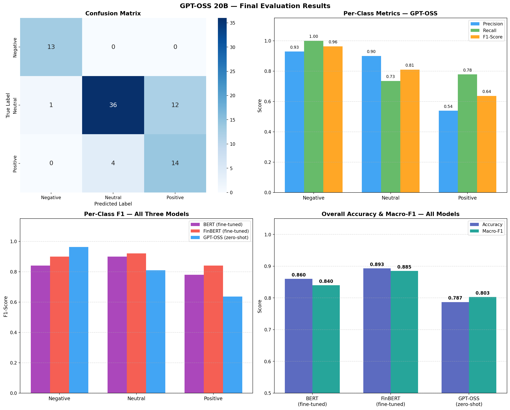
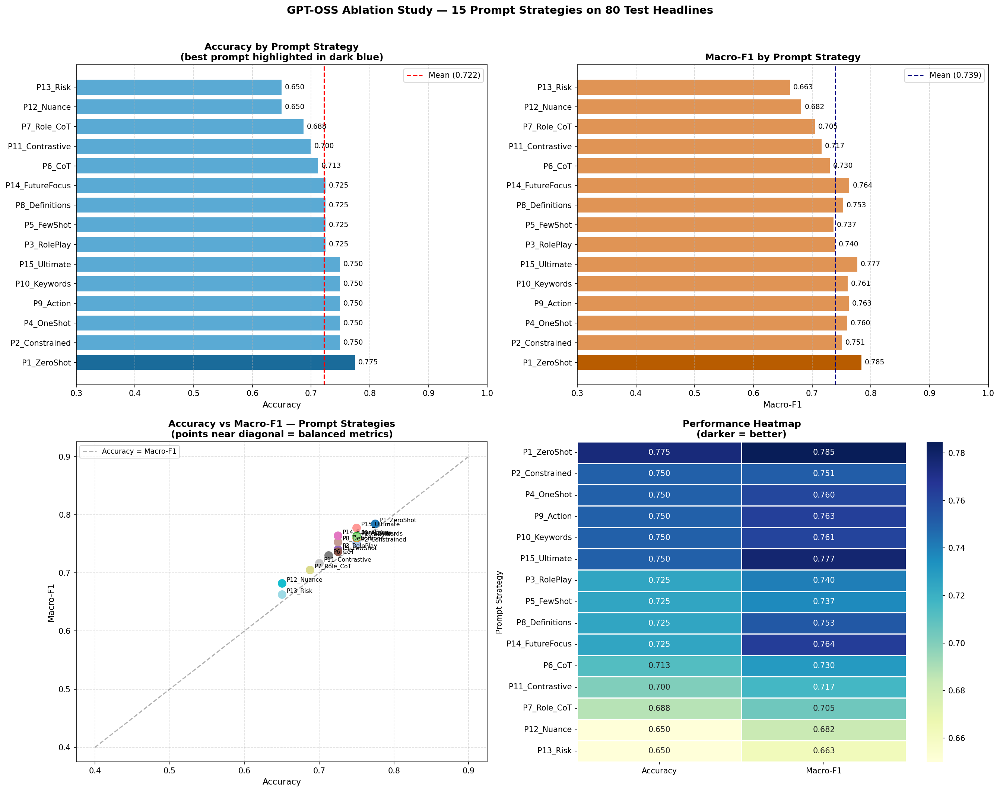

# Financial Sentiment Analysis: Model Comparisons & Fine-Tuning

## Overview
This repository investigates various NLP models for classifying the sentiment of financial news headlines into **negative**, **neutral**, or **positive**.

The repository is split into two main core projects:
1. **BERT vs FinBERT**: Fine-tuning transformer models (`bert-base-uncased` and `ProsusAI/finbert`).
2. **GPT & OSS LLMs**: Evaluating large language models (LLMs) via zero-shot prompting compared to fine-tuned BERT models.

---

## 🚀 Setup & Usage

### 1. Requirements
- Python 3.12+
- macOS (MPS) / Linux (CUDA) / CPU

### 2. Installation
```bash
# Clone the repository
git clone https://github.com/mehrdat/assignment_fine_tune.git
cd assignment

# Create and activate virtual environment
python -m venv .venv
source .venv/bin/activate

# Install dependencies
pip install -r requirements.txt
```

### 3. How to Run the Code
The project relies on Jupyter notebooks. Open them sequentially in Jupyter or VS Code and run all cells:
- **`fine_bert.ipynb`**: Contains data preparation, training, and evaluation of BERT and FinBERT models.
- **`gptoss_final.ipynb`**: Evaluates GPT and Open-Source LLMs for zero-shot text classification and compares them.
- **`comparison final.ipynb`**: Performs an ablation-style comparison across all evaluated models.

---

## 📊 Project 1: BERT vs FinBERT (Fine-Tuning)

**Goal:** Compare a general-purpose language model (`bert-base-uncased`) with a financially pre-trained model (`ProsusAI/finbert`) — before and after task-specific fine-tuning.

### Results summary

| Model | Stage | Accuracy | Macro F1 | Weighted Precision | Weighted Recall |
|---|---|---|---|---|---|
| **FinBERT** | Before FT | **89.26%** | 88.22% | 89.88% | 89.26% |
| **BERT-base** | Before FT | 59.30% | 24.81% | 35.16% | 59.30% |
| **FinBERT** | After FT | **89.26%** | **88.51%** | **89.34%** | 89.26% |
| **BERT-base** | After FT | 85.95% | 84.01% | 85.91% | 85.95% |

**Key Takeaways:** 
* Pre-training strictly on financial domain data (FinBERT) yields spectacular "out-of-the-box" zero-shot performance.
* Fine-tuning successfully brings the general BERT-base model up to competitive standards (85.9%), although FinBERT maintains a slight edge internally.

---

## 🤖 Project 2: LLMs Zero-Shot vs Fine-Tuned Models (Ablation Study)

**Goal:** Evaluate if modern generative LLMs (like GPT and Open-Source models) can perform out-of-the-box classification better than dedicated fine-tuned classification models.

### Visual Results & Comparisons

**GPT vs. OSS Models Performance**


**Ablation Study (All Models Overview)**


**Key Takeaways:**
* While powerful, generic LLMs relying on zero-shot prompting can sometimes hallucinate or diverge from strict output formats compared to fine-tuned classification models.
* Fine-Tuned NLP models like FinBERT remain highly practical, cost-effective, and highly accurate for strict categorical tasks like Sentiment Analysis.

---

## 📂 Project Structure

```text
assignment/
├── fine_bert.ipynb                  # Train & Evaluate BERT vs FinBERT
├── gptoss_final.ipynb               # LLM Zero-shot inference
├── comparison final.ipynb           # Holistic models comparison
├── resources/
│   ├── cn7050data.csv               # Raw dataset
│   ├── model_comparison_results.csv # Exported numerical metrics
│   ├── ablation_study_plots.png     # Saved Plot Output
│   └── gpt_oss_final_plots.png      # Saved Plot Output
├── requirements.txt                 # Dependencies
└── README.md                        # Documentation
```
